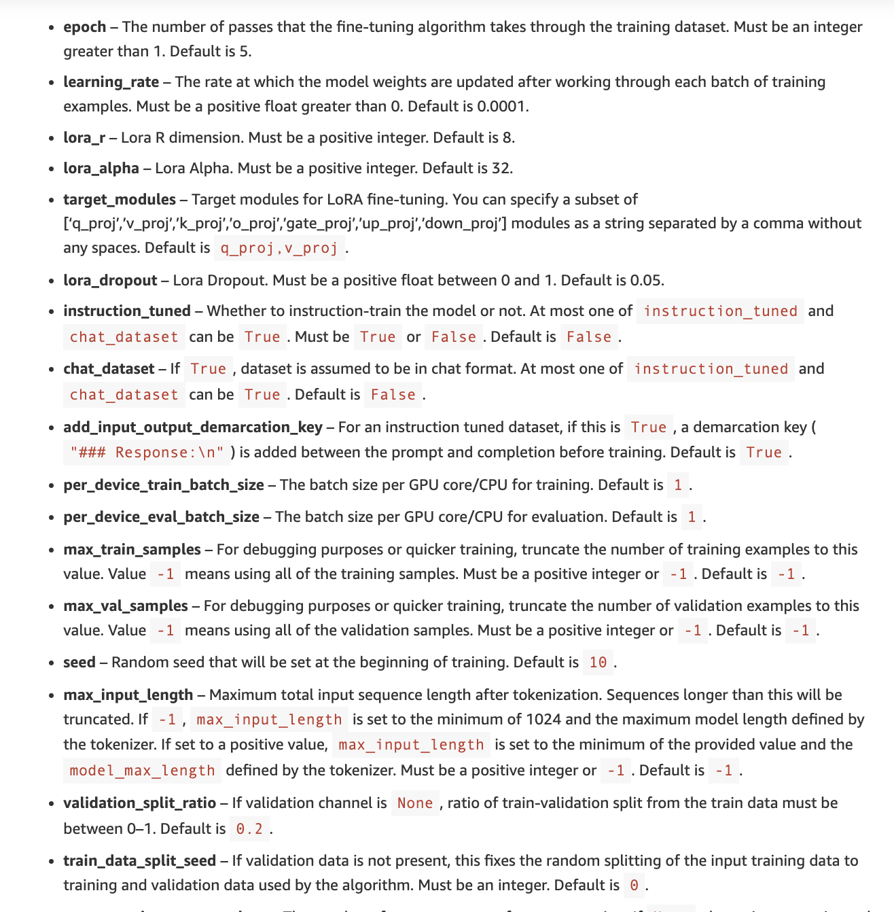
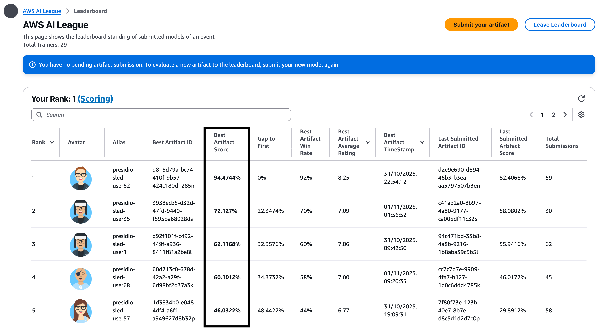

I promised a lot of folks I'd write a blog if I win, so here's me penning this down after finishing 2nd in the AWS AI League. Before we begin, here's a little brief about the competition itself, it consists of two rounds,

1) You are given a 72 hours to fine-tune a Llama 3.2 8B model to the given domain using AWS Sagemaker Jumpstart. The fine-tuned model when submitted is evaluated and rated against the Llama 3.2 70B model using LLM as a judge using a fixed set of 50 undisclosed questions. If your fine-tuned model's answer is better, you get a point. Participants are ranked based on these points in the leaderboard.
2) For the second round, top 5 candidates from the first round are chosen. This time, participants get to craft a system prompt that their fine-tuned model (from the previous round) takes in to answer the question. In this round, the answers are evaluated by human judges (40%), LLM (40%) and audience (20%). The winner is decided based on these points after 5 questions.

## Preparation

Although I have been working with LLMs for the past couple of years, prior to this event, I have only fine-tuned a model once that too with help. So, I set out to understand it deeply before the competition and started my prep one week prior.

For starters this [video series by AWS](https://www.youtube.com/watch?v=gZP9N86b248&list=PLBm5soQMjeJ0-h5Dfp_iUFyjUDDbxM8S4&index=7) helped me get familiar with sagemaker and model finetuning. I also looked at several LLM leagues of the past, stumbled upon a blog from the winner of the, [Singaporean AI league](https://medium.com/@andyphuawc/my-secret-sauce-for-the-inaugural-singapore-nationwide-aws-large-language-models-league-llml-983d02e63cb3) and the blog from [first round winner](https://github.com/taswhe/2024-sg-lol-papaoutai) from the same league. Both these blogs talk about data preparation and hyperparameters tuning and what worked for them. I noted them all down religiously. For those of you who don't know, hyperparameters are basically like configuration settings that you can adjust while fine-tuning a model.

While I was familiar with data preparation, I realised that I needed to learn more about hyperparameters, that's when I stumbled upon this [blog from AWS](https://aws.amazon.com/blogs/machine-learning/fine-tune-llama-3-for-text-generation-on-amazon-sagemaker-jumpstart/) which was good starting point. In addition, the information about time taken for each instance size and config pair to fine-tune a model at the end of the page was a cherry on the top.



Plus reading about these hyperparameters experiments from [Finetuning LLMs with LoRA and QLoRA: Insights from Hundreds of Experiments](https://lightning.ai/pages/community/lora-insights/) and [Practical Tips for Finetuning LLMs Using LoRA](https://magazine.sebastianraschka.com/p/practical-tips-for-finetuning-llms) made me realise that these parameters are inherently dependant upon the data, what works for one set may not necessarily work for another set but it also gave me an idea on what parameters to experiment, particularly the insight about enabling LoRA for more layers proved very effective. You can find my [raw notes](https://github.com/nobodyme/aws-ai-league/blob/main/resources.md) that I took while reading these articles and [more over here](https://github.com/nobodyme/aws-ai-league/blob/main/resources.md)

Crux of what I learnt,
- An epoch is a hyperparameter representing one complete pass through the entire training dataset during the model training process
- lora_r (rank) ranges from 4 to 256, with 8, 16, and 32 being common choices (determines the number of trainable parameters in the adaptation layers - high value meaning longer training time and more adaptability)
- lora_alpha is a scaling factor that controls the magnitude of the LoRA weight updates, controls impact of adaptations and is generally 2x of lora_r but above blog suggests successes with 0.5x of lora_r too.
- r too large or epoch too large could result in overfitting

Since, I had time, I thought why not write scripts to automate these. So, I wrote them for,
1) Deploying the base model
2) Uploading dataset to s3
3) Deploying the finetuned models with the given array of hyperparameters (so I don't have to experiment one by one)
4) Evaluation against the base model or a previously finetuned model to check if I made it worse or not (I thought this will be faster than submitting to the leaderboard)
Even wrote scripts for increasing service quota limits for required instances, if not already present. You can [find them all here](https://github.com/nobodyme/aws-ai-league/tree/main/jumpstart). 
By doing these, I thought I'll just concentrate on preparing a good dataset on the event day.

**SPOILER ALERT**: None of these were useful in the competition, since we weren't given access to jupyter notebook or AWS access key and secret key for the account. So, everything had to be done manually through the console.

Talking about data prepation, both these blogs talk about generating data through [partyrock](https://partyrock.aws/), few partyrock apps listed below,
- [QnACrafter](https://partyrock.aws/u/papaoutai/ovCF-g4rS/QnACrafter/) - Used by the round 1 winner for the singaporean league
- [Simple-AWS-LLMs-League-Dataset-Generator](https://partyrock.aws/u/TheRayG/PmL1RViBp/Simple-AWS-LLMs-League-Dataset-Generator)
- [Advanced-AWS-LLMs-League-Dataset-Generator](https://partyrock.aws/u/TheRayG/IInyME_vt/Advanced-AWS-LLMs-League-Dataset-Generator) both by AWS themselves
- [LLMs-Datasets-Generator](https://partyrock.aws/u/JiaweiLin/IvPiedcHN/LLMs-Datasets-Generator)

I tried QnACrafter and even modified it slightly to [suit my usecase](https://partyrock.aws/u/nobodymenav/hZpzbBFCU/QnACrafter2025-SLED) for the event.

But what if synthetic data generation doesn't work?
I will then have to look at actual sources in the internet, but data can be in different formats like pdf, webpage or csv?

So, I looked for tools that allow us to scrape data from any available source format with minimal effort which is when I landed on [synthetic-data-kit](https://github.com/meta-llama/synthetic-data-kit) from Meta, which seems to be built exactly for this purpose, a CLI app that one can run locally and will produce questions and answer pairs in the format of your choice. It also checks for duplicates and evaluates whether the generated pair is of high quality. Seemed like a perfect fit. It internally uses LLM behind the scenes to generate these datasets and allows prompt customization as well. One thing it lacked was direct Azure OpenAI model support, I quickly modified the code to add that and built a thin wrapper on top of it to automate even further, you can find the [source code here](https://github.com/nobodyme/aws-ai-league/tree/main/data-preparation/synthetic-data-kit).

So, at this point, I was clear on how to prepare data and what hyperparameters to experiment with and all set for the competition.

## Round 1 - Fine-Tuning

The exact usecase to fine-tune our model was given on the competition day, although we were told the overall domain as "SLED" earlier.


I honestly did not know what SLED even encompasses. So, I set out to find it.
First I tried my modified, [QnACrafter app](https://partyrock.aws/u/nobodymenav/hZpzbBFCU/QnACrafter2025-SLED). It auto selects different aspects when a topic is given (one can also manually specify topics) and prepares question and answers for it, that gave me a hint but I wanted to dig deeper. A combination of few aspects from party rock and googling. I asked chatgpt for more such topics, using this prompt below,

```
US State government, Local and Education - understand citizen needs in plain language. 
Handle complex scenarios like "I want to open a food truck" or "My neighbor's tree fell on my property" while providing step-by-step guidance through permit applications and licensing.
Datasets generated should include realistic user queries and appropriate concise and helpful answer like an assistant from US gov public services

I am building a dataset that will help US citizens in navigation government bureaucracy
What all aspects should I cover, I have a few, listed below.

Business Licensing & Permits, Property Rights & Disputes, Education Services, Public Services & Utilities, Public Health, 
Public Transport, 311 requests, building permits, health and food inspection, business registration, property and assessment, 
public works and ROW permits, trees and neighbour hood issues, fire inspection and permits, benefits and human services, 
education, transportation and DMV, Courts & clerks, Community legal aid guide, Street use / right‑of‑way, 
Food vending & food truck, Stormwater & drainage

I want you to think about all such aspects a citizen will reach out to State and local government officals, just like I have written,

Categorize them, example,
1. Business
- (topic related to business why they would reach out, like) business licensing
- business permits

And so on, for all possible things one would likely reach out
```

It responded with the topic and subtopics below, exactly what I was looking for,

```
 1. Business & Commerce
 - Business formation (LLC/DBA, Secretary of State filings)
 - General business license / local tax receipt
 - Industry licenses (food service, salon, contractor, childcare, auto dealer)
 ...

 2. Building, Construction & Permitting
 - Building/alteration permits; plan review
 - Mechanical/electrical/plumbing permits
 - Occupancy and fire safety certificates
 ...
```

Full set of topics can be [found here](https://github.com/nobodyme/aws-ai-league/blob/main/data-preparation/generate-data-gpt/topics.py). I generated to about 144 topics. The idea was to feed in these topics to QnACrafter and copy the generated answers but by default it only accepts 4 at a time. Customizing the app to accept more resulted in partial generation, I am assuming due to rate limiting. So, I quickly realized this is going to be time consuming and that it would be easier to write a python script instead that works with LLM models. So, that's what I did, you can [find that here](https://github.com/nobodyme/aws-ai-league/tree/main/data-preparation/generate-data-gpt).

The script used **gpt-4o** and takes in a list of topics, and generates N of questions for each topic. Each question is then passed onto another answer prompt which generates the answer. This gave me [my first dataset](https://github.com/nobodyme/aws-ai-league/blob/main/data/first-dataset.jsonl), roughly 870 odd instruction set.

After the competition many asked me, how I de-duplicated by dataset. Well, with this process I didn't have to. My topics were diverse enough and I only generated 6 questions per topic that I didn't need to do de-duplication at all.

I uploaded the dataset with the base hyperparameter configuration, by this time, 5 hours had already passed, I haven't even looked at the leaderboard yet. The model scored just **31.8%** but I decided to perform all the hyperparameter tuning experiments that I learned about before discarding the dataset entirely. 

- Started with increasing epoch from 1 - 5. The evaluation percentage increased and started to decrease at 5 so maintained the **epoch at 4**. 
- Enabling LoRA modules for all layers instead of the default query and key gave me the biggest jump, got me to **86%** at epoch 3 and **88%** at **epoch 4** with **lora_r at 8** and **lora_alpha at 16**.

So, the same dataset that got me 31% also fetched me 88% just by tuning the parameters, in other words my fine-tuned LLM is already answering 44/50 questions better than the 70B model.


Here's the link to the [full experimentation sheet](https://github.com/nobodyme/aws-ai-league/blob/main/data/Finetune.xlsx).

After this, I tried a lot of variations with the dataset. 

- If you observe my previous dataset was generic but we know laws can be different from state to state, so I generated locality specific data which fetched me just **15%** with my best hyperparameter configuration. I understood that the evaluation is not locality specific and discarded it entirely.
- Then, I thought maybe rest of those 6 questions are in spanish since US has a sizable spanish population. This also did not improve my score.
- Generated summary based question and answer pair and combined it with my first dataset. Once again, I observed that it performed worse.
- Generated more topics with ChatGPT and used by script to prepare more question/answer pairs for those topics. This improved my score and took me to **90%**
- Any further topic generation also did not improve the scoreboard.
- I also tried switching from gpt4o to 5-mini, although the questions generated were even more realistic for the same prompt, the score still dropped, suggesting that the evaluation set had simpler question equivalent to what 4o generated.
- Then, my **highest score** came from simply appending refusal type datasets to my first dataset. By refusal I mean, refusing to answer anything irrelevant or aiding harmful intent like giving away personal information of a neighbour etc. This got me upto **94%**.

By this time, I was out of ideas to experiment with datasets but I continued experimenting with various other exotic hyperparameter configurations.

One tuning configuration with **lora_r = 256** and **lora alpha = 128** yielded, 0.001% more than my current best model but later looking at the eval / train loss under performance metric on jumpstart I realised this model overfits a bit. You can find the comparison of the parameters below.


Good rule of thumb is to have the eval loss close to training loss, which you can observe in the best model. This means the model generalizes well, otherwise it means the model is overfitting, i.e memorizing training data, such a model won't fare well with new questions outside training data spec.

I did not check the metrics before submitting despite knowing that a higher value of r is likely to produce a model that overfits. Unfortunately, I couldn't beat this model and since AWS copies the model with the highest score for the next round, this ended up being my model for the finals. (Yes, I reached out if they could change the model chosen immediately after the first round, organizers said they couldn't)

Anyway, this is how the leaderboard looked at the end of 72 hours of the first round where I ended up finishing first.




## Final Round - Prompt Engineering

All our models from the previous round is put to test infront of the audience with human and LLM judges alike. I had the opportunity to witness AI league final round for another domain in the morning, where I observed humans preferring shorter, succient answers (at least that's what I thought). So, I planned to prepare a prompt that gives concise answers too.

We were given access to the site where the questions appear, we had the ability to tweak the **system prompt** that goes into the model, **temperature** and **top_p**. One had about 60 seconds for each question and we were allowed to generate answers any number of times and submit your best answer.

```
You are a knowledgeable, efficient, and direct AI assistant that helps US residents navigate public services reducing friction.
Utilize multi-step reasoning to provide concise answers, focusing on key current information in plain language and short sentences. Avoid jargon; if you must use a legal term, define it.
If multiple questions are asked, split them up and address in order that yields the most logical and accurate response.
Offer suggestion tacfully when appropriate to improve outcomes.
Engage in productive collaboration with the user
```

While the LLMs favoured the answer by my model, humans did not and that reflected heavily on the scoreboard. The general consensus talking to the audience after the show was that my LLM did not empathize with the user which is why they did not favour it. Looking at my training data (which already empathizes with the user) and final round output, I had a feeling I botched this with my prompt forcing it to be too concise. Nevertheless, I was pretty happy to finish in the second place and loved the overall experience with the league itself. I love debugging in general and I viewed this AI league as a gamified version of debugging a black box(evaluator LLM) and I really played it like a game from the first day with all my little experiements.


## Learnings

At the end you build for humans, so it would have been wise to choose the training data to human preference than just judging by the LLM evaluation score. If I were to do it again, I'd probably have a vote with non-participants and choose the one they like best. I realised even format of the response played a big role. Some of my datasets had answers beginning with `### ANSWER` or `### RESPONSE` and that reflected in the type of outputs it produced as well. To anyone taking this up again, look for these small things to have a edge in the final round, all top 5 participants are probably going to have the facts right for a given question, so how you differentiate your answer to better align with human preference is going to be the key.

Looking at the bigger picture, I learnt a lot about fine-tuning in less than 2 weeks, excited to see where I can put these skills to use in real projects.