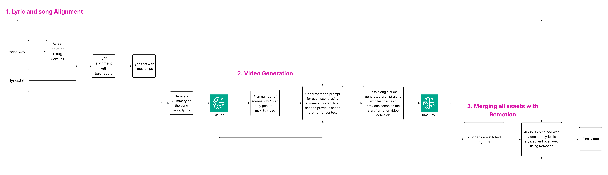

Given the song as wav and lyrics as text, produce a music lyric video where video is in the background and lyrics is in the foreground

Constraints: Use everything from AWS or things that can be hosted in AWS

This consists of 3 subproblems

How to sync/align the lyrics to the song?

How to generate the said lyric video?

Once video is generated, how to overlay/merge the lyrics along with audio in the video?

1. How to sync/align the lyrics to the song?

Here we have the song and already have the lyrics, we don’t need to transcribe, transcribing a song also doesn’t yield accurate lyrics

What we need is technically called forced-alignment, i.e, given a text/lyrics match with the audio get timestamps of the lyrics and produce a SRT file.

For this, explored various tools, like,

Aeneas (older) - installation didn’t not work  - should try in linux based system - failed

whisper x - promised word level accuray, but again transcribes and transcription is not good, unnecessary when you have lyrics - not good

https://docs.pytorch.org/audio/stable/tutorials/ctc_forced_alignment_api_tutorial.html  - produces output but it is not totally accurate (60%) - closest

None of the above methods yielded good results, so tried separating out vocals and then aligning with lyrics, hoping for better alignment

Vocal separation with HPSS technique - not good - didn’t separate out vocals

Demucs worked best - near perfect separation - best

https://github.com/pettarin/forced-alignment-tools  - list of all other tools - yet to try

Combination of torchaudio and demucs gave us a SRT which we use in the video 

2. How to generate the said lyric video?

Used Luma ray, it worked well, generates 5 or 9 second clips also allows to extend video, given the last frame as well

First step, split lyrics into 9s scenes and generate prompt with Claude using the below items, to send to the video model

Used summary of the song

Current set of lyrics

Last scene generation prompt 

Last frame of the previous generated video to produce cohesive next scene

3. Once video is generated, how to overlay/merge the lyrics along with audio in the video?

Remotion, helps combine - lyrics, video and audio.
Of course ffmpeg also does it, but remotion helps us style lyrics using css, so that’s a plus and so can be customized based on the mood of the song

For now, generated a short video and looped over to fill the audio length, noticed 99% accurate lyric sync with the audio

What can be improved?

The beats, cultural nuances, theme and other metadata of the song can be provided alongside the summary to produce the video

Prepare a good story arc for the entire video, current generation doesn’t have a story arc

Fixed color palette determinisation to be used across the video once mood of the song is obtained

Include beats, tempo information of the song to maybe match the video

Lyric-aware layout: break lines where the singer breathes; avoid widows/orphans

Expressive words: animate specific words (“fall”, “rise”, “fade”) with matching motion presets